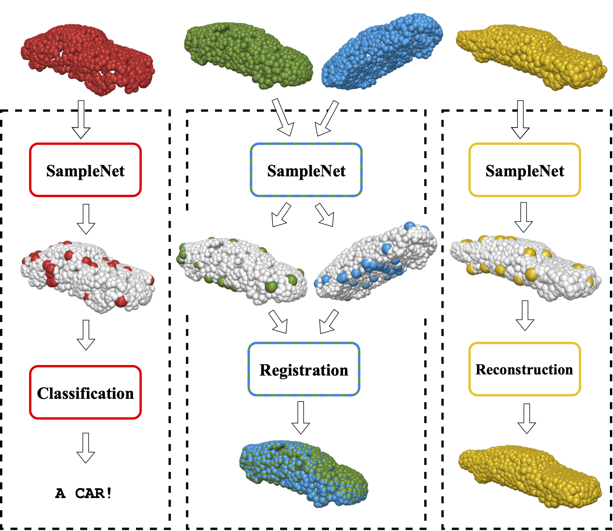

# SampleNet: Differentiable Point Cloud Sampling
Created by [Itai Lang](https://itailang.github.io/), [Asaf Manor](https://www.linkedin.com/in/asaf-manor-446979101/), and [Shai Avidan](http://www.eng.tau.ac.il/~avidan/) from Tel Aviv University.



## Introduction
This work is based on our [arXiv tech report](https://arxiv.org/abs/1912.03663). Please read it for more information. You are also welcome to watch the [oral talk](https://youtu.be/wOKlqnJ0XcE) from CVPR 2020.

There is a growing number of tasks that work directly on point clouds. As the size of the point cloud grows, so do the computational demands of these tasks. A possible solution is to sample the point cloud first. Classic sampling approaches, such as farthest point sampling (FPS), do not consider the downstream task. A recent work showed that learning a task-specific sampling can improve results significantly. However, the proposed technique did not deal with the non-differentiability of the sampling operation and offered a workaround instead.

We introduce a novel differentiable relaxation for point cloud sampling. Our approach employs a soft projection operation that approximates sampled points as a mixture of points in the primary input cloud. The approximation is controlled by a temperature parameter and converges to regular sampling when the temperature goes to zero. During training, we use a projection loss that encourages the temperature to drop, thereby driving every sample point to be close to one of the input points.

This approximation scheme leads to consistently good results on various applications such as classification, retrieval, and geometric reconstruction. We also show that the proposed sampling network can be used as a front to a point cloud registration network. This is a challenging task since sampling must be consistent across two different point clouds. In all cases, our method works better than existing non-learned and learned sampling alternatives.

## Citation
If you find our work useful in your research, please consider citing:

	@InProceedings{lang2020samplenet,
	  author = {Lang, Itai and Manor, Asaf and Avidan, Shai},
	  title = {{SampleNet: Differentiable Point Cloud Sampling}},
	  booktitle = {Proceedings of the IEEE/CVF Conference on Computer Vision and Pattern Recognition (CVPR)},
	  pages = {7578--7588},
	  year = {2020}
	}

## Installation and usage
This project contains three sub-directories, each one is a stand-alone project with it's own instructions. Please see the `README.md` in **classification**, **registration**, and **reconstruction** directories.

### Usage of SampleNet in another project
Classification and reconstruction projects are implemented in TensorFlow. Registration is implemented with PyTorch library. We provide here an example code snippet, for the usage of PyTorch implementation of SampleNet with any task. The source files of SampleNet for this example are in **registration/src/** folder.
```python
import torch
from src import SampleNet, sputils

"""This code bit assumes a defined and pretrained task_model(),
data, and an optimizer."""

"""Get SampleNet parsing options and add your own."""
parser = sputils.get_parser()
args = parser.parse_args()

"""Create a data loader."""
trainloader = torch.utils.data.DataLoader(
    DATA, batch_size=32, shuffle=True
)

"""Create a SampleNet sampler instance."""
sampler = SampleNet(
    num_out_points=args.num_out_points,
    bottleneck_size=args.bottleneck_size,
    group_size=args.projection_group_size,
    initial_temperature=1.0,
    input_shape="bnc",
    output_shape="bnc",
)

"""For inference time behavior, set sampler.training = False."""
sampler.training = True

"""Training routine."""
for epoch in EPOCHS:
    for pc in trainloader:
        # Sample and predict
        simp_pc, proj_pc = sampler(pc)
        pred = task_model(proj_pc)

        # Compute losses
        simplification_loss = sampler.get_simplification_loss(
                pc, simp_pc, args.num_out_points
        )
        projection_loss = sampler.get_projection_loss()
        samplenet_loss = args.alpha * simplification_loss + args.lmbda * projection_loss

        task_loss = task_model.loss(pred)

        # Equation (1) in SampleNet paper
        loss = task_loss + samplenet_loss

        # Backward + Optimize
        optimizer.zero_grad()
        loss.backward()
        optimizer.step()
```

## License
This project is licensed under the terms of the MIT license (see `LICENSE` for details).
